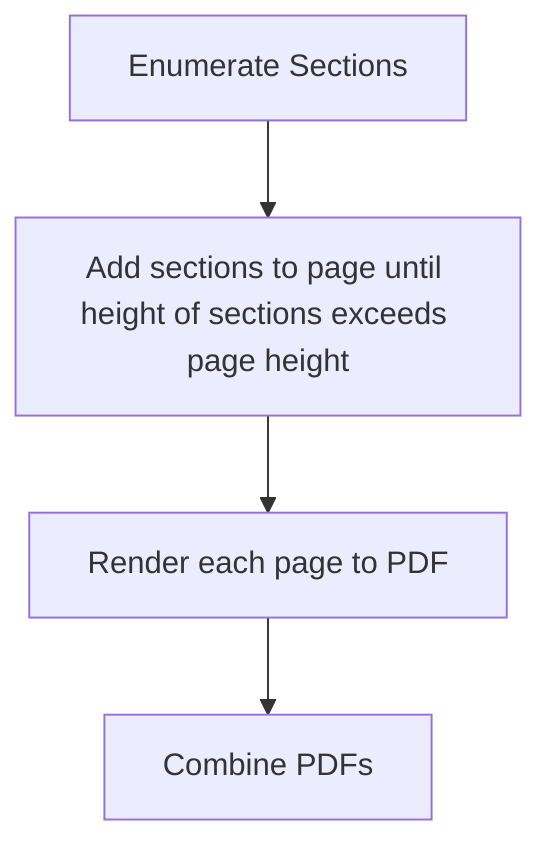

Inspired by projects like [jsonresume.org](https://jsonresume.org). Why is making a decent looking resume so difficult? One wrong move in Word and your whole document is garbled. If you want anything unique, you have to learn some obscure publishing software. Editing your resume should be as easy as editing a text document. You shouldn't have to fuss over the layout every time you add something.

# Why not jsonresume?

1) jsonresume is old. Lots of the tooling associated with it is outdated.
2) jsonresume enforces a specific schema (most of which I don't use, and some of which I disagree with). This project uses a non-opinionated JSON schema. You can add or remove whatever you want, and reference it directly via handlebars.
3) Perhaps the biggest reason, jsonresume did not render to PDF well. Resume websites are cool, but at some point you're going to want a document. This project tries to render a PDF based on the HTML template in an attractive way, preserving desired margins and breaking pages at the correct points (more on this below).

# Usage

Clone the repository and run `npm i`. This will install the necessary dependencies.

To build the website, run `npx gulp build` from the project directory. This will compile the handlebars template and output resume.html in the /dist folder. You can serve this file from your website or do anything else you can do with HTML.

To start see the website in a browser, run `npx gulp test`. The site will update live with changes to the handlebars template, the scss file, and the json resume file.

To generate a pdf of your resume, run `npx gulp generatePdf` from the project directory. The pdf will be generated in the project directory as resume.pdf by default.

You can specify a JSON input file using the command line argument `--i /path/to/your/resume.json`. This will work with any of the commands listed above. If you do not specify an input file, the commands will use resume.json in the root of the project directory.

Similarly, you can specify a PDF output file using the command line argument `--o /path/to/your/resume.pdf`. This is only applicable to the `generatePdf` command above.

# PDF Rendering

This is where things get interesting. Puppeteer is used to launch a headless browser, which renders the website. Javascript is injected into the site to enumerate all divs with class `section`. Divs with class `section` represent sections of content that should NOT be separated by a page break. Modify the handlebars templates accordingly. By using `section` divs, we can ensure that content will not be broken across pages where we don't want it to be.

The `section` divs are broken into pages. The pagination process is kind of interesting, so I'll breifly discuss it. First, we have a div with class `#mock-page` in the handlebars template. The css for this div is set up so that it is the size of a desired page (A4) - note the usage of pt units here. The injected javascript can then get the `clientHeight` for this element, which gives us the approximate height in pixels of an A4 page (this will be different for different screens, which is why we go through all of this trouble). Knowing the size of a page in pixels, we can then enumerate each `section` div, adding them to a parent div with class `page` - where page is also set up with css to be the size of an A4 page with desired margins - until the page is full. A new page can then be created, and sections added to it.

Side note: the margins for the PDF are set via the `$margin` variable in styles.scss. If you want to change the margins, change this value.

A brief overview of the pagination process:

All of this is to say, the HTML should be converted to PDF cleanly, with desired margins and page breaks.